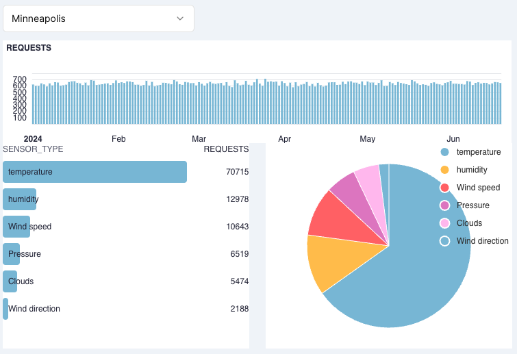

# Example code for a session on building dashboards.
### Adding Tinybird Charts to a Next.js frontend

In this session we work with a stream of [Mockingbird](https://mockingbird.tinybird.co/?host=us_gcp&datasource=events&eps=100&withLimit=on&generator=Tinybird&endpoint=us_gcp&limit=-1&generatorName=Tinybird&template=Custom&schema=%28%27timezmpKGdatetimeBetweenOzrtR1-01F8endR6-19F%27%29E~transacX_idKyj%21%27strqg.uuid%27%29~endpoqtK*%27get_Vports8curVnt_condiXs8get_extVmes8daiU8monthU350%2C25ffIEE~cityK*%27Denver8Salt+Lake+City8Chicago8Mqneapolis8Houston8New+York8Miami8Los+Angeles35575fffIIIEE~sensor_tyjK*%27temjratuV8humidityQsjed8PVssuV8CloudsQdiVcX36572f%2C6I%2C2EE%29*GpickWeightedOvalueJ3%27%5D~weightJ7%2C18%27~E%5D%29FT00%3A00%3A00.000ZGyj%21%27mockqgbird.I%2C5Js%21%5BK%21%28%27tO8paramJ%28%27Q8Wqd+R%21%272024-0Uly_ztsVreXtionf70jpeqinzsta%01zqjfXVURQOKJIGFE873*_) data that simulates events coming from a weather data application.


```json
{
    "timestamp": "2024-06-20T02:26:31",
    "transaction_id": "c762f0f7-ac31-4761-a598-6db488d24cfc",
    "endpoint": "get_reports",
    "city": "Minneapolis",
    "sensor_type": "temperature"
}
```

We take this data and build a simple real-time databoard. 



## Getting started

This repo contains a minimal example demonstrating:

1. Creating Tinybird Charts from the UI
2. Integrating Tinybird Charts into a Next.js frontend

You can read more about Tinybird Charts in the [documentation](https://www.tinybird.co/docs/publish/charts), and there is a full [end-to-end guide](https://www.tinybird.co/docs/guides/integrate/add-charts-to-nextjs) covering this example.

## Run the example locally

### Prerequisites

- Node.js >= v18
- A [free Tinybird account](https://tinybird.co)
- Deploy the [Tinybird resources](/tinybird) to a Tinybird Workspace

### Install dependencies

Install app dependencies. From the root of the repo:

```bash
npm install
```

### Generate some data
Use [Mockingbird](https://mockingbird.tinybird.co/?host=us_gcp&datasource=events&eps=100&withLimit=on&generator=Tinybird&endpoint=us_gcp&limit=-1&generatorName=Tinybird&template=Custom&schema=%28%27timezmpKGdatetimeBetweenOzrtR1-01F8endR6-19F%27%29E~transacX_idKyj%21%27strqg.uuid%27%29~endpoqtK*%27get_Vports8curVnt_condiXs8get_extVmes8daiU8monthU350%2C25ffIEE~cityK*%27Denver8Salt+Lake+City8Chicago8Mqneapolis8Houston8New+York8Miami8Los+Angeles35575fffIIIEE~sensor_tyjK*%27temjratuV8humidityQsjed8PVssuV8CloudsQdiVcX36572f%2C6I%2C2EE%29*GpickWeightedOvalueJ3%27%5D~weightJ7%2C18%27~E%5D%29FT00%3A00%3A00.000ZGyj%21%27mockqgbird.I%2C5Js%21%5BK%21%28%27tO8paramJ%28%27Q8Wqd+R%21%272024-0Uly_ztsVreXtionf70jpeqinzsta%01zqjfXVURQOKJIGFE873*_) to generate fake data for the `events` Data Source.

Using this link ^ provides a pre-configured schema, and you'll just need to enter your Workspace Admin Token and select the Host region that matches your Workspace. When configured, select Save, then scroll down and select Start Generating!.

In the Tinybird UI, confirm that the events Data Source is successfully receiving data.


### Add your Tinybird parameters

First create a new file `.env.local`
```bash
cp .env.example .env.local
```

From the Tinybird UI, copy the read Token for the charts (if you deployed the resources from this repo, it will be called `CHART_READ_TOKEN`). Paste the Token into the `.env.local` file in your directory:

```bash
NEXT_PUBLIC_TINYBIRD_STATIC_READ_TOKEN="STATIC READ TOKEN"
```

### Run the demo app

Run it locally:

```bash
npm run dev
```

Then open [http://localhost:3000](http://localhost:3000) with your browser.
