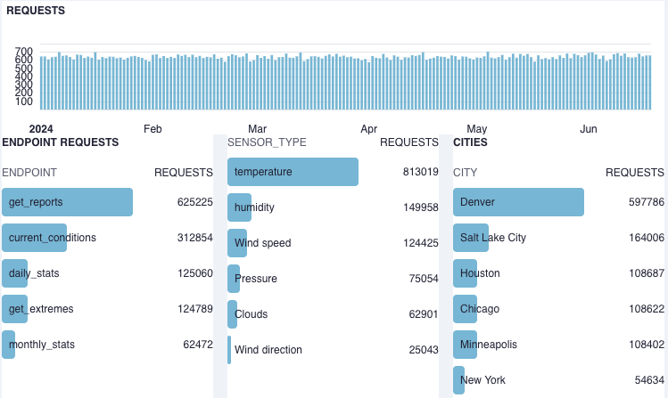

## Getting started

Here, we start with a simple `page.tsx` file that will host the Tinybird Charts.

```javascript
'use client'

import { useState } from "react";
 
import { CitySelect } from "@/components/CitySelect";

const pageTitle = "Your weather dashboard";
const token = process.env.NEXT_PUBLIC_TINYBIRD_STATIC_READ_TOKEN ?? ''; 

export default function StaticDashboard() {
  const [city, setCity] = useState('Denver');
  const handleCityChange = (value: string) => {
    setCity(value);
  };

  return (
    <main className="mx-auto w-3/4">
      <h1 className="text-2xl font-bold my-8">{pageTitle}</h1>
      <section> Requests by city </section>
      <div>
        <div className="my-3">
          <CitySelect city={city} onChange={handleCityChange} />
        </div>
      </div>  
      <div>
      </div>
      <div className="grid grid-cols-2 gap-6"> 
      </div>
      <section> Total requests </section>
       <div>
      </div>
      <div className="grid grid-cols-3 gap-4">
      </div>
    </main>
  );
}
```

## Adding and updating Chart code

As Chart code is copies to the project, apply these updates:

```javascript
const TINYBIRD_TOKEN = process.env.NEXT_PUBLIC_TINYBIRD_STATIC_READ_TOKEN;
```

And replace the hardcoded token with:
```javascript
token={TINYBIRD_TOKEN}
```

Confirm that the export function names match the component names:
* export function **SensorTypes** 
* export function **SensorTypesPie**
* export function **TopEndpoints**
* export function **Cities**
* export function **Requests** 

As Charts are added to the project, these imports statements are added: 

```javascript
import { SensorTypes} from "./charts/SensorTypes";
import { SensorTypesPie} from "./charts/SensorTypesPie"
import { TopEndpoints} from "./charts/TopEndpoints";
import { Cities } from "./charts/Cities"
import { Requests } from "./charts/Requests"
```

## Rendering charts

The simple UI has two sections. 

### Top section

The top section with a `City` picker and three charts related to that pick. Here we use a `CitySelect` UI component to set a `city` variable. That variable is then passed in as a query parameter to the underlying endpoint requests. 

```javascript
<div className="my-3">
    <CitySelect city={city} onChange={handleCityChange} />
</div>
<div>
    <Requests city={city} />
</div>
<div className="grid grid-cols-2 gap-6"> 
    <SensorTypes city={city} />
    <SensorTypesPie city={city} />
</div>
```


### Bottom section

The bottom section is a collection of scripts that apply to the entire dataset. 

```javascript
<div>
    <Requests />
</div>
<div className="grid grid-cols-3 gap-4">
    <TopEndpoints />
    <SensorTypes />
    <Cities />
</div>

```
